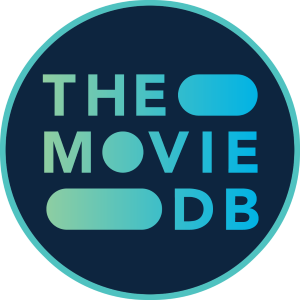

# 👋 Hi, I'm **Raghavan**

I'm a Full Stack web developer. who is excited to contribute to open source and learn new things.

**For *Freelancing*, like personal website, tools and scripts - message me on reddit [u/anonymous_sfdol](https://www.reddit.com/user/anonymous_sfdol) or send friend request to [@tetrax10](https://discord.com/users/1040249560418750536) on Discord**

You can also sponsor me to continue any of my archived projects like [Nord Spotify](https://github.com/Tetrax-10/Nord-Spotify), [Spicetify Extensions](https://github.com/Tetrax-10/Spicetify-Extensions)

### Freelancing projects I have done that are open source

1. [Batch metadata editor](https://github.com/Tetrax-10/batch-metadata-editor) for [POPE3909](https://xdaforums.com/m/pope3909.5120701/)

# Links

